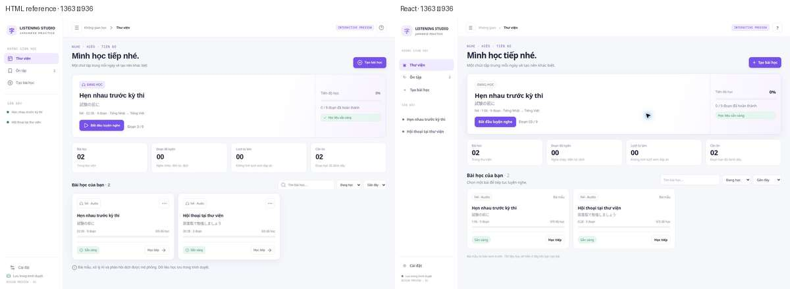

# React entry screen design QA

**Final result: passed**

## Comparison

Compared the library screen from `apps/web/public/studio-preview.html` with the native React library view at **1363 × 936 CSS pixels**, using the same sample lesson state. The browser captures are shown together below.

## Findings and fixes

- The first React implementation left the default route on the iframe preview and kept the API library in the old dark theme. The default route now redirects to the native React library; `/preview` remains the standalone reference.
- The first native capture was missing the top bar and recent lesson navigation, and its heading sat too high. The React shell now uses the preview's sidebar sections, top bar, and spacing.
- Sample dashboard statistics initially counted all chunks as completed. The sample state now shows zero completed chunks, matching the preview.
- Uploaded video assets now render beside the bilingual transcript, and the visible video element shares seeking, playback, speed, and volume controls. YouTube imports remain audio-only, consistent with the current backend importer.

## Required fidelity surfaces

- **Typography:** Inter/system UI text and Japanese system fallback; the library heading uses the preview's 28 px scale and compact labels.
- **Layout and spacing:** 218 px navigation rail, 64 px top bar, matching content inset, progress card, four statistic cards, and lesson grid.
- **Color:** light gray canvas, white surfaces, fine lavender-gray borders, violet primary controls, and green readiness badges.
- **Imagery:** the library reference contains no photographic artwork; no replacement assets were needed.
- **Copy:** the headline, sample lesson names, Japanese text, progress labels, and Vietnamese controls follow the preview.

## Interaction and build checks

- Browser: lesson search, audio/video filter, empty-filter state, and create dialog open/close passed.
- Local React view build: `npm run build` passed.
- Repository CI for the implementation commit: passed (run 9).
- Mobile layout and actual video playback were not captured in this pass because no test media fixture was available. Existing media queries remain in place; the video player only appears when the source asset is identified as video.
