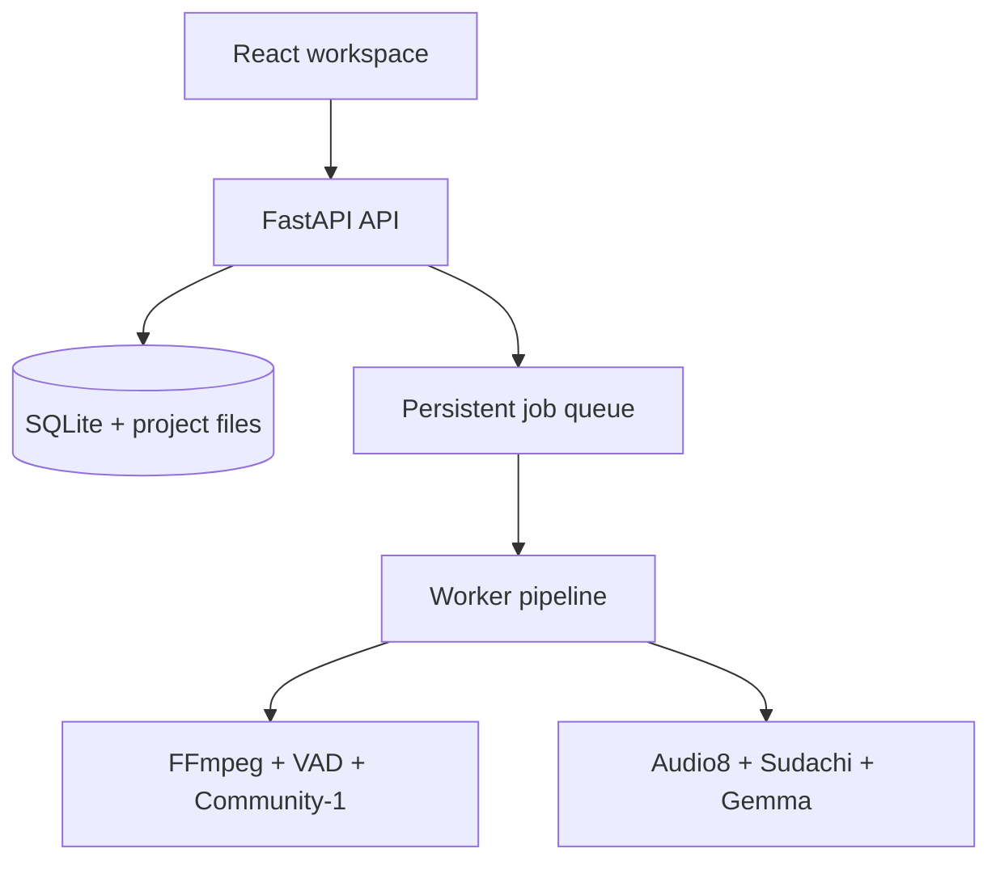

# Architecture

JLPT Listening Studio is a local-first desktop-style web application. Vite serves the React UI and FastAPI serves a JSON API on `127.0.0.1:8765`. A separate worker claims persistent SQLite jobs, so closing the browser does not lose a long-running pipeline.

The pipeline stores normalized playback Opus, mono 16 kHz analysis WAV, waveform peaks, VAD/diarization artifacts and model-run metadata. Each stage has an input hash; a retry can reuse completed artifacts. A confirmed transcript is never overwritten by a later Audio8 run.

The browser receives full text only in editor/transcript routes. Practice uses a metadata-only chunk endpoint and exercises redact transcript/token surfaces. An explicit answer endpoint or a revealed attempt is the answer boundary.

## Processing stages

1. Validate and inspect the source media with ffprobe.
2. Normalize playback and analysis audio and generate min/max waveform peaks.
3. Run Silero VAD with configurable threshold, minimum speech/silence and padding.
4. Run `pyannote/speaker-diarization-community-1` locally (or download once with a Hugging Face token).
5. Intersect VAD and exclusive speaker turns, then create semantic chunks. Speaker changes are hard boundaries and every chunk is capped at 28 seconds for Audio8.
6. Slice cached 16 kHz WAV files and transcribe with `Edge0/Audio8-ASR-0.1B`.
7. Tokenize Japanese with SudachiPy and render furigana.
8. Translate batches with previous/target/future context through a local Gemma 4 llama.cpp server.

The worker reports stage progress through SSE. The UI falls back to polling when the SSE connection drops.
